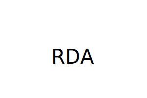

# SVG-Logo-Maker
Object-oriented Programming: SVG Logo Maker

## Description
This is an SVG logo generator using inquirer

## Table of Contents
1. [Description](#description)
2. [Installation](#installation)
3. [Usage](#usage)
4. [License](#license)
5. [Contributing](#contributing)
6. [Tests](#tests)
7. [Questions](#questions)
        
## Installation
inquirer, jest
        
## Usage
To create an svg logo for your projects.
        
## License

        
## Contributing
KlosheKopa
        
## Tests
Test for each shape
        
## Questions
Questions? Feel free to reach out through the following channels:

- [GitHub](https://github.com/KlosheKopa)
- Email: aarondrichards98@gmail.com

[svgGenVideo.webm](https://drive.google.com/file/d/1FR6J915rm6SuFnwEtKBYHYPn-D1HwxKZ/view)